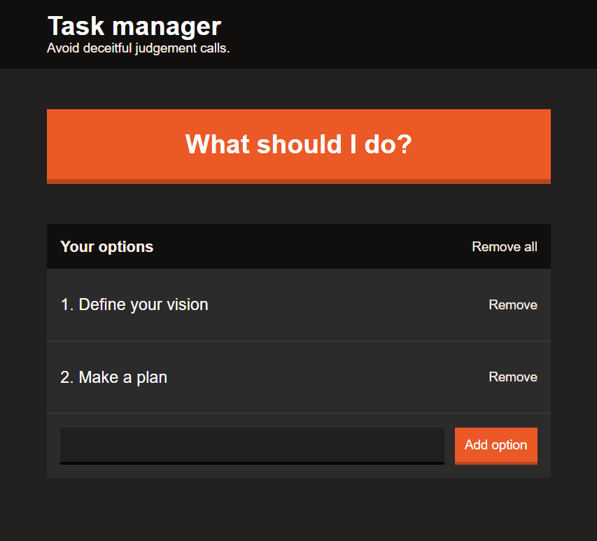

# REACT TASKMANAGER / TO-DO APP #

Responsive &amp; modular taskmanager/to-do list app implemented with React. Styling is done with SASS. [App is hosted with Heroku.](https://react-taskmanager.herokuapp.com/)

Yarn is used for package management.

Dependencies:
* Babel as comiler (https://babeljs.io/)
    * Babel-cli
    * Babel-core
    * Babel-loader
    * Babel plugin transform class properties
    * Babel preset env
    * Babel preset react
* CSS loader (https://github.com/webpack-contrib/css-loader)
* Express (https://expressjs.com/)
* Extract text webpack plugin (https://github.com/webpack-contrib/extract-text-webpack-plugin)
* Live server: (https://www.npmjs.com/package/live-server)
* Node SASS (https://www.npmjs.com/package/node-sass)
* Normalize.css (https://www.npmjs.com/package/normalize.css)
* React (https://reactjs.org/)
    * React-dom
    * React-modal
* Sass-loader (https://github.com/webpack-contrib/sass-loader)
* Style-loader (https://github.com/webpack-contrib/style-loader)
* Validator (https://www.npmjs.com/package/validator)
* Webpack (https://webpack.js.org/)
    * Webpack DevServer